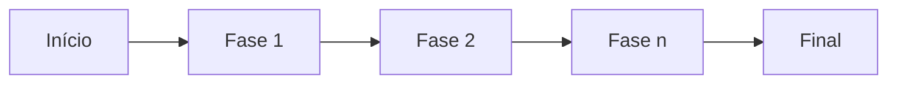
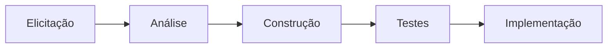
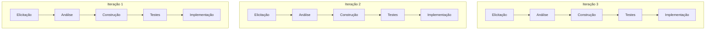

#ESW 

> [!important] Projeto
> Empreendimento TEMPORÁRIO para a criação de um produto ou serviço ÚNICO

> [!note] Ciclo de vida
> Processo pelo qual um projeto passa, desde o seu começo quanto sua finalização

# Ciclo de Vida Tradicional
- Cada fase acontece ***sequencialmente***

- Mais lento
- Melhor para projetos pequenos
# Ciclo de Vida Iterativo-Incremental
- Cada fase acontece ***concorrentemente***

- Ciclo de vida mais rápido
- Mais dinâmico
- Ideal para ambientes burocráticos
